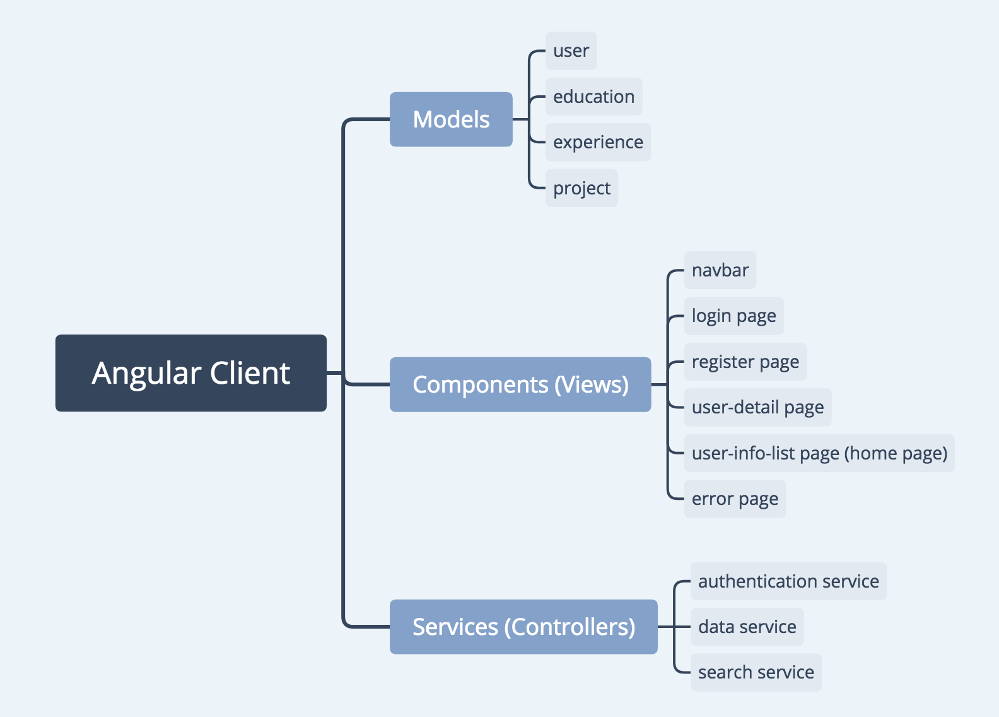
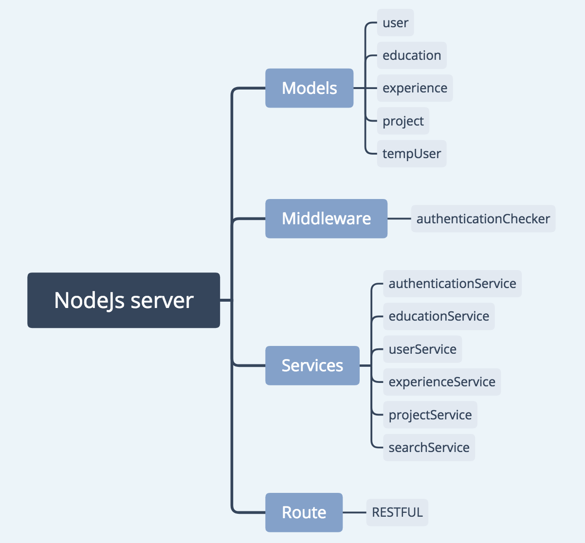

# Project Title

Talens3 Website (http://talents3.com)

## Description

As new graduates in engineering, we know how difficult for new grads to find jobs. So we build this web to help more students and make their life easier. By using our system, once you have registered and updated your profile page, you are all set. Our system will match you skills, education, and experiences with thoundsand of positions, and send your profile to their recruiters and human resources managers.

### Built With

* [Angular](https://angular.io/) - The web framework used
* [MongoDB](https://mlab.com/) - Online MongoDB
* [NodeJS](https://nodejs.org/en/) - The web backend server
* [ExpressJS](https://expressjs.com/) - The backend routing and middleware web framework

### Prerequisites

You will need node and npm installed globally on your machine.


### Installing

Install latest Angular

```
sudo npm install -g @angular/cli@latest
```

Build frontend Angular module

```
cd client
ng build
```

Install backend Libraries

```
cd server
npm install
```

Setup the port you want to use, change ./server/server.js like this,

```
app.listen(3000, () => console.log('Example app listening !'));
```
Setup the configuaration at ./server/config/database.js like this, 

```
module.exports = {
  'secret':'yourSecret',
  'database': 'your mongo db setup', (mongodb:/***:***@****.mlab.com:51210/talents-web-user-db)
  'numsPerPage': 30,
  'initialNumOfUsers': 30,
  'emailAccount': 'email', 
  'emailPassword': 'password'
};

```

Start the server and 

```
npm start
```


## Project Structure





### MVC model

A Model–view–controller design pattern decouples major components

## Connecting Angular client and NodeJS server

Angular Build the modules to public folder including index.html.

NodeJS server use express.static to serve static files. If the url does not handled by router on the server side, then the server send index.html from the public folder
```
app.use(express.static(path.join(__dirname, '../public')));
app.use((req, res) => {
    res.sendFile('index.html', { root: path.join(__dirname, '../public')});
});
```

## Routing

NodeJS server use express to create http application and set "/api/v1" as the server main prefix. (in ./server/server.js) 

```
const app = express();
const restRouter = require('./routes/rest');
app.use('/api/v1',restRouter);
```

Then use express router to handle http request, set up the backend router in ./server/routes/rest.js

```
const router = express.Router();
```

Angular client router set up the path to different components(views), details in ./client/src/app/app.routes.ts
```
 const routes: Routes = [
    {
        path: '',
        redirectTo: 'users',
        pathMatch: 'full'
    },
    {
        path: 'users',
        component: UserInfoListComponent
    },
    .
    .
    .
    .
```

## Data flowing

Follow is an example for the user detail page. 

When user click the user card, client redierct to /user/:id. Based on Angular router, userDetailComponent will be rendered.
```
{
        path: 'users/:id',
        component: UserDetailComponent
}
```
userDetailComponent will trigger the frontend service(controller) to get the user infomation

```
this.route.params.subscribe(params => {
      this.dataService.getUser(+params['id']).then(.......)
          
```

The frontend service dataService uses httpClient module to send a get request to backend server.
```
getUser(id: number): Promise<User> {
    return this.httpClient.get(`api/v1/users/${id}`)
      .toPromise()
      .then((res: any) => res)
      .catch(this.handleError);
  }
```

In server side, express router handle the get request
```
//Get User By Id
router.get('/users/:id', function (req, res) {
    const id = req.params.id;
    userService.getUser(+id)
      .then(user => res.json(user));
});
```

The backend service userService will get the result from database and return it 
```
const getUser = function(id) {
    return new Promise((resolve, reject) => {
        User.findOne({id: id}).populate('educations').populate('experiences').populate('projects')
        .exec((err, user) => {
            if (err) {
                reject(err);
            } else {
                resolve(user);
            }
        });
    });
}

```

Finally, frontend view will get the info and display it.  


## Pagination 

The frontend user-list-component(home page) subcripts the frontend dataService user resource and display those user cards.
```
this.subscriptionUsers = this.dataService.getUsers()
            .subscribe(users => this.users = users);
```

The frontend dataService holds the current data get from backend server and return it as Observalble. 
```
private _userSource = new BehaviorSubject<User[]>([]);

getUsers(): Observable<User[]> {
    if (this._userSource.value.length == 0) {
      this.httpClient.get('api/v1/users')
        .toPromise()
        .then((res: any) => {
          this._userSource.next(res);
        })
        .catch(this.handleError);
    }

    return this._userSource.asObservable();
 }
```
Initially, the amount of user info is limited. When we scroll down the home page, getMoreUsers() will be triggered and load more data from backend.  

To prevent extra or unnecessary requests, we use loadash to set up debounce time.
```
debounceGetMoreUsers = _.debounce(() => this.getMoreUsers(), 500, {});

@HostListener("window:scroll", [])
    handleScroll() {
      let scrollY = window.scrollY || window.pageYOffset || document.documentElement.scrollTop;
      if ((window.innerHeight + scrollY) >= (document.body.offsetHeight - 50)) {
          if (!this.isSearchMode) {
            this.debounceGetMoreUsers();
          } else {
            this.debounceGetMoreSearchResults();
          }
      }
    }
```

Once the getMoreUsers() is triggered, dataService will send a request with current loaded number to backend. The response from the backend will be concated to the BehaviorSubject. Then frontend views will update immediately. 
```
getMoreUsers(): Promise<User[]> {
    return this.httpClient.get(`api/v1/users/nums/${this._userSource.value.length}`)
      .toPromise()
      .then((users: any) => {
        this._userSource.next(this._userSource.value.concat(users));
        return users;
      })
      .catch(this.handleError);
 }
```

NodeJS service will find results in database and return a spcific amount of data back based on the current loadded number pass in the get request.

```
router.get('/users/nums/:num', (req, res) => {
    const num = req.params.num;
    userService.getMoreUsers(+num)
      .then(users => res.json(users));
});

const getMoreUsers = function(curNum) {
    return new Promise((resolve, reject) => {
        User.find({})
            .skip(curNum)
            .limit(config.numsPerPage)
            .populate('educations').populate('experiences')
            .exec((err, users) => {
                if (err) {
                    reject(err);
                } else {
                    resolve(users);
                }
            })
    })
}
```

## Deployment 

Set up an was account, and launch a EC2 instance in any place you want. For our web server, we launch the instance in North Virginia. Follow the instructions here https://aws.amazon.com/premiumsupport/knowledge-center/create-linux-instance/, you can launch your instance quickly. Please remember after launched your instance, you should add your security group, because our server listens on port 80,  need to make sure TCP port range can cover this port. After launch it, you need to connect to your linux instance, follow the instructions here https://docs.aws.amazon.com/AWSEC2/latest/UserGuide/AccessingInstances.html.  Then in your instance terminal go to your root directory , and install npm, yarn, node, git, angular and other useful packages globally. Remember one thing, when you installing angular, you should better install yarn first, and use yarn to help you install angular cli, this will make your life easier.  After installed all these necessary tools, use git clone to download your code from your own repository(next time use git pull to update). Go to client directory, and run this command, “ng build”, then go to server directory, run, “nobup node server.js&” (this will make your server running in background).

